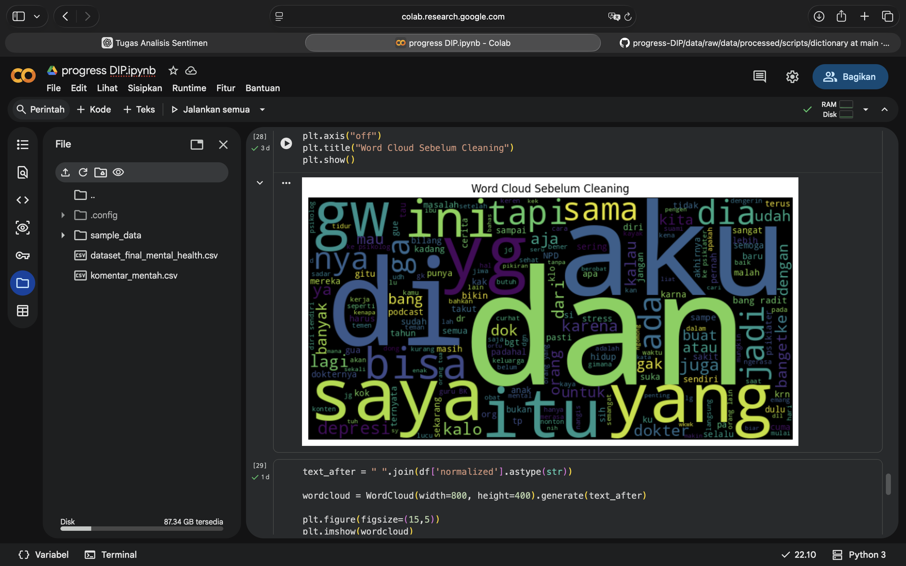
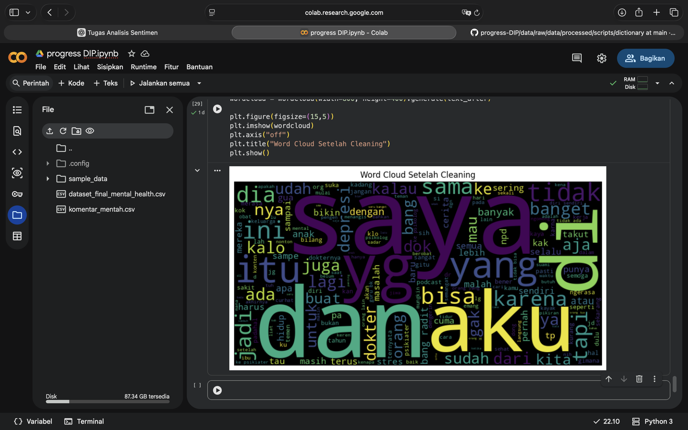

# Analisis Sentimen dan Normalisasi Bahasa Gaul pada Komentar YouTube terkait Stress dan Kesehatan Mental

## Deskripsi

Penelitian ini bertujuan melakukan preprocessing data komentar YouTube terkait kesehatan mental menggunakan teknik normalisasi bahasa gaul dan sentiment labeling.

## Sumber Dataset

Komentar diambil dari video YouTube:

- https://youtu.be/9QnsB9SCzjw
- https://youtu.be/q5x1SNjRQwY

## Tahapan Pengerjaan

### Minggu 1–2
- Scraping komentar YouTube

### Minggu 3–4
- Data profiling
- Analisis noise
- Analisis duplikat

### Minggu 5–6
- Case Folding
- Regex Cleaning
- Filtering

### Minggu 7–8
- Normalisasi bahasa gaul

### Minggu 9–10
- Keyword-based labeling

### Minggu 11–12
- Validasi data
- Dokumentasi preprocessing

## Struktur Folder

```bash
data/raw/ → dataset mentah

data/processed/ → dataset hasil preprocessing

scripts/ → notebook Google Colab

dictionary/ → kamus slang
```

## Word Cloud Sebelum Cleaning



## Word Cloud Setelah Cleaning



## Tools

- Python
- Google Colab
- Pandas
- Regex
- WordCloud
- GitHub

## Author

Nama: Syifa Satrio
